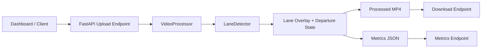

# RoadVision Lane Intelligence

RoadVision Lane Intelligence is a real-time computer vision project for lane detection, lane overlay generation, and lane departure intelligence on road footage. It is built as a practical applied CV system: a FastAPI backend owns upload and processing, an OpenCV pipeline performs frame-level lane reasoning, and a Streamlit dashboard gives a clean operator view with performance metrics and downloadable results.

> Demo assets are intentionally placeholders until a public road clip is added.
>
> - Demo GIF: `assets/demo/roadvision-demo.gif`
> - Dashboard screenshot: `assets/screenshots/dashboard.png`
> - Processed output screenshot: `assets/screenshots/lane-overlay.png`

## Problem Statement

Dashcam and ADAS-style systems need to understand where the vehicle sits inside the lane, not only whether lane markings exist. RoadVision processes forward-facing road video, estimates lane boundaries, overlays the inferred lane corridor, and flags potential left/right drift when the camera center moves away from the lane center.

## Why This Matters

Lane departure warning is a foundational perception feature in driver assistance. Even a classical CV baseline is valuable because it is fast, explainable, cheap to run, and easy to debug. RoadVision focuses on this engineering tradeoff: build a transparent lane intelligence pipeline before reaching for heavier neural models.

## Features

- Video upload through FastAPI or the Streamlit dashboard
- OpenCV lane detection pipeline using HLS lightness, Gaussian smoothing, Canny edges, ROI masking, and probabilistic Hough lines
- Real-time lane corridor overlay and in-frame status HUD
- Lane departure warnings: `CENTERED`, `DRIFTING_LEFT`, `DRIFTING_RIGHT`, and `LANE_NOT_CONFIDENT`
- FPS, average latency, max latency, resolution, departure-frame count, and low-confidence-frame count
- Processed MP4 output and metrics JSON download
- Structured logging to `logs/roadvision.log`
- Modular codebase designed for extension, benchmarking, and deployment

## Architecture



The system design is deliberately simple:

`frontend/dashboard -> FastAPI upload endpoint -> CV processing pipeline -> lane overlay output -> metrics + downloadable result`

## How Lane Detection Works

1. **Color-space selection**
   The detector converts each frame to HLS and uses the lightness channel. Lane paint tends to remain more distinguishable in this channel than in raw RGB when the road has mild lighting variation.

2. **Noise reduction**
   A small Gaussian blur suppresses high-frequency texture from asphalt before edge extraction. This improves Hough line stability without washing out lane boundaries too aggressively.

3. **Edge extraction**
   Canny edge detection identifies strong intensity transitions. This is a fast classical CV step that works well when lane markings are clear.

4. **Region of interest**
   The detector masks the lower trapezoid of the frame, where lane markings are physically expected from a forward-facing camera. This removes sky, vehicles, trees, signs, and irrelevant road background.

5. **Line fitting**
   Probabilistic Hough lines produce candidate line segments. Candidates are split into left and right lanes by slope and frame position, then averaged with segment length as the weight.

6. **Departure logic**
   The vehicle is approximated as the horizontal frame center. RoadVision compares that center against the estimated lane center near the bottom of the frame. If the offset exceeds a configurable ratio of frame width, the frame is marked as a drift event.

## Tech Stack

- Python
- OpenCV
- NumPy
- FastAPI
- Streamlit
- Pandas
- Uvicorn

## Repository Structure

```text
backend/
  main.py                       FastAPI app and download endpoints
  pipeline/
    lane_detector.py            Frame-level lane detection and drift logic
    video_processor.py          Video IO, overlays, metrics, and run artifacts
  utils/
    logger.py                   Structured logging setup
frontend/
  app.py                        Streamlit dashboard
docs/
  ARCHITECTURE.md               System design details
  ENGINEERING_NOTES.md          CV decisions, tradeoffs, and extension notes
assets/
  demo/                         Demo GIF/video placeholder
  screenshots/                  Screenshot placeholders
sample_data/                    Local sample video placeholder
```

## Setup

```bash
python -m venv .venv
.venv\Scripts\activate
pip install -r requirements.txt
```

Run the API:

```bash
uvicorn backend.main:app --reload
```

Run the dashboard from the repo root:

```bash
streamlit run frontend/app.py
```

## Sample Road Video Instructions

Use a short forward-facing driving clip for first tests:

- 720p or 1080p MP4
- 10 to 30 seconds
- Daylight footage with visible lane markings
- Camera near the windshield center
- Avoid clips where the road is mostly blocked by traffic

Suggested sources:

- Your own dashcam/mobile footage from a safe, stationary setup
- Public road datasets that permit reuse, such as TuSimple, KITTI road/lane samples, or BDD100K clips

Place local clips in `sample_data/`. Raw videos are ignored by git to avoid committing large files.

## API Endpoints

| Method | Endpoint | Purpose |
| --- | --- | --- |
| `GET` | `/health` | Service health check |
| `POST` | `/api/v1/process-video` | Upload and process a video |
| `GET` | `/api/v1/results/{job_id}/video` | Download processed MP4 |
| `GET` | `/api/v1/results/{job_id}/metrics` | Download metrics JSON |

Example upload:

```bash
curl -X POST "http://127.0.0.1:8000/api/v1/process-video" \
  -F "file=@sample_data/road_clip.mp4"
```

## Benchmarks

Benchmark numbers depend on CPU, resolution, codec, and road complexity. Record your own runs using the metrics JSON generated for each processed video.

| Resolution | Clip Length | Source FPS | Processing FPS | Avg Latency | Notes |
| --- | ---: | ---: | ---: | ---: | --- |
| 1280x720 | 15 sec | 30 | TBD | TBD | Daylight, clear lane paint |
| 1920x1080 | 15 sec | 30 | TBD | TBD | Higher IO and per-frame cost |

Metrics captured per run:

- `processing_fps`
- `avg_latency_ms`
- `max_latency_ms`
- `lane_departure_events`
- `low_confidence_frames`
- `processed_frames`

## Failure Cases

RoadVision is intentionally transparent about where a classical CV pipeline struggles:

- **Shadows:** strong tree/building shadows can create edges that look lane-like.
- **Night roads:** low contrast and headlight glare reduce reliable edge extraction.
- **Curves:** straight-line Hough fitting is less stable on sharp curves.
- **Faded lanes:** weak paint produces low-confidence or missing lane estimates.
- **Occlusion:** vehicles blocking lane markings can cause temporary drift or confidence errors.
- **Camera placement:** off-center cameras can bias the departure offset unless calibrated.

## Future Improvements

- Add camera calibration and perspective transform for bird's-eye lane estimation
- Replace straight-line fitting with polynomial lane curves
- Add temporal smoothing across frames
- Estimate approximate lane width and reject physically implausible detections
- Add model-based segmentation for night, rain, and worn-lane robustness
- Add unit tests with synthetic frames and regression clips
- Package the backend and dashboard with Docker

## Recruiter Pitch

RoadVision Lane Intelligence demonstrates applied computer vision judgment beyond a notebook demo. It includes a modular OpenCV pipeline, production-style API boundaries, operator-facing metrics, clear failure analysis, and a dashboard that supports real video processing and artifact download. The project is intentionally explainable, benchmarkable, and ready to evolve into a more advanced perception stack.
