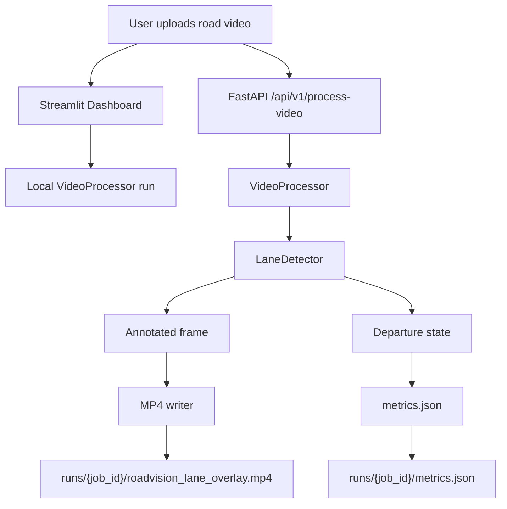

# Architecture

RoadVision is split into three concerns: user interaction, API orchestration, and computer vision processing.



## Components

### Streamlit Dashboard

The dashboard is optimized for quick local demonstration. It accepts a video, previews the input, runs the processor, shows FPS/latency/departure metrics, and exposes artifact downloads.

### FastAPI Backend

The API provides a service boundary suitable for deployment or integration with another frontend:

- validates file type and empty uploads
- stores uploaded files in `uploads/`
- processes video through the shared pipeline
- returns job metadata and download URLs
- serves processed MP4 and metrics JSON artifacts

### VideoProcessor

`VideoProcessor` owns video IO, frame iteration, timing, output writing, and metrics aggregation. It keeps frame-level CV independent from file handling so the detector can be tested with still frames.

### LaneDetector

`LaneDetector` owns the perception logic:

- HLS lightness extraction
- Gaussian blur
- Canny edge detection
- trapezoidal region-of-interest masking
- Hough line candidate generation
- slope-based left/right lane separation
- weighted line fitting
- lane-center departure estimation

## Data Flow

1. A user uploads a video.
2. The system validates format and metadata.
3. Frames are read sequentially using OpenCV.
4. Each frame is sent to `LaneDetector`.
5. The detector returns an annotated frame, confidence score, and departure state.
6. The processor writes annotated frames into an MP4.
7. Runtime metrics are saved as JSON.
8. The user downloads the processed video and metrics.

## Artifact Layout

```text
runs/{job_id}/
  roadvision_lane_overlay.mp4
  metrics.json
```

## Deployment Notes

For a simple deployment, run the API and dashboard as separate processes. For a more production-oriented setup, containerize the FastAPI service and keep the dashboard as a thin client over the upload endpoint.

The current pipeline is CPU-first. That makes it easy to run on student laptops and low-cost cloud instances, but heavy 1080p videos may still be IO-bound.
